# Diagrama UML — Sistema Bradesco PIX

> Arquivo principal: `diagrama.puml` (PlantUML)
> Para renderizar: instale a extensão **PlantUML** no VSCode ou use [plantuml.com/plantuml](https://www.plantuml.com/plantuml)

---

## Visão Geral da Arquitetura

```
┌─────────────────────────────────────────────────────────┐
│                     FRONTEND (React + TypeScript)        │
│                                                         │
│  Pages         Context        Services       Types      │
│  ───────       ───────        ────────       ─────      │
│  Inicio        UserContext    UsuarioSvc     IUsuario   │
│  Pagamento                    TransacaoSvc   ITransacao │
│  NovoPag.                     DenunciaSvc    IDenuncia  │
│  Comprovante                  AuditoriaSvc   IDenAudit. │
│  Extrato                      PixService                │
│  Denuncias                                              │
│  Auditoria                                              │
│  Perfil                                                 │
└─────────────────────┬───────────────────────────────────┘
                      │ HTTP/REST (Axios)
┌─────────────────────▼───────────────────────────────────┐
│                   BACKEND (Express.js / Node.js)         │
│                                                         │
│  Routes           Models (Sequelize)                    │
│  ──────           ─────────────────                     │
│  /usuarios        Usuario                               │
│  /transacoes      Transacao                             │
│  /denuncias       Denuncia                              │
│  /pix             LogAuditoria                          │
│  /auditoria                                             │
└─────────────────────┬───────────────────────────────────┘
                      │ Sequelize ORM
┌─────────────────────▼───────────────────────────────────┐
│                      MySQL Database                      │
│                                                         │
│  Tabelas: Usuario, Transacoes, Denuncias, LogsAuditoria │
└─────────────────────────────────────────────────────────┘
```

---

## Diagrama de Classes (Mermaid)

```mermaid
classDiagram

  %% ========================
  %% ENUMERACOES
  %% ========================

  class TipoTransacao {
    <<enumeration>>
    PIX
    TED
    DOC
    BOLETO
    TRANSFERENCIA_INTERNA
  }

  class StatusTransacao {
    <<enumeration>>
    PROCESSANDO
    PROCESSADO
    EM_ANALISE
    SUSPEITO
    DEVOLVIDO
    FALHOU
  }

  class MotivoDenuncia {
    <<enumeration>>
    FRAUDE
    GOLPE
    ENGANO
    INVASAO_CONTA
    OUTROS
  }

  class StatusDenuncia {
    <<enumeration>>
    PENDENTE
    EM_ANALISE
    CONFIRMADA
    RECUSADA
    APROVADA_AGUARDANDO_FUNDOS
  }

  class RoleUsuario {
    <<enumeration>>
    usuario
    auditor
  }

  %% ========================
  %% MODELOS BACKEND
  %% ========================

  class Usuario {
    +Integer id PK
    +String nome
    +String cpf UNIQUE
    +Decimal saldo
    +Boolean denuncia
    +Integer recebeu_denuncia
    +RoleUsuario role
  }

  class Transacao {
    +Integer id PK
    +String e2e_id UNIQUE
    +Decimal valor
    +TipoTransacao tipo
    +StatusTransacao status
    +String descricao
    +Date data_transacao
    +String ip_origem
    +String idempotency_key UNIQUE
    +Decimal saldo_anterior_origem
    +Decimal saldo_posterior_origem
    +Decimal saldo_anterior_destino
    +Decimal saldo_posterior_destino
    +Integer origem_id FK
    +Integer destino_id FK
  }

  class Denuncia {
    +Integer id PK
    +Integer transacao_id FK
    +String e2e_id UNIQUE
    +Decimal valor_roubado
    +MotivoDenuncia motivo
    +String descricao
    +StatusDenuncia status
    +Date sla_limite
    +Date data_denuncia
    +Integer id_denunciante FK
    +Integer id_denunciado FK
  }

  class LogAuditoria {
    +Integer id PK
    +Integer denuncia_id
    +Integer auditor_id
    +String decisao
    +String motivo
    +String observacoes
    +Decimal valor_devolvido
    +Timestamp criado_em
  }

  %% ========================
  %% RELACIONAMENTOS BANCO
  %% ========================

  Usuario "1" --> "0..*" Transacao : origem
  Usuario "1" --> "0..*" Transacao : destino
  Usuario "1" --> "0..*" Denuncia : denunciante
  Usuario "1" --> "0..*" Denuncia : denunciado
  Transacao "1" --> "0..1" Denuncia : possui

  %% ========================
  %% INTERFACES FRONTEND
  %% ========================

  class IUsuario {
    <<interface>>
    +number id
    +string nome
    +string cpf
    +number saldo
    +boolean denuncia
    +number recebeu_denuncia
    +string role
  }

  class ITransacao {
    <<interface>>
    +number id
    +number valor
    +string data_transacao
    +string e2e_id
    +string status
    +Object origem
    +Object destino
  }

  class IDenuncia {
    <<interface>>
    +number id
    +number valor_roubado
    +string data_denuncia
    +string sla_limite
    +string motivo
    +string status
    +number transacao_id
    +Object denunciado
  }

  class IDenunciaAuditoria {
    <<interface>>
    +number id
    +number valor_roubado
    +string sla_limite
    +string motivo
    +string status
    +Object denunciado
    +Object denunciante
  }

  %% ========================
  %% SERVICOS FRONTEND
  %% ========================

  class UsuarioService {
    +buscarPorId(id) IUsuario
    +listarTodos() IUsuario[]
  }

  class TransacaoService {
    +listarPorUsuario(usuarioId) ITransacao[]
  }

  class DenunciaService {
    +listarPorDenunciante(id) IDenuncia[]
    +registrar(dados) IDenuncia
    +remover(id, idDenunciante) void
  }

  class AuditoriaService {
    +listarPendentes(auditor_id) IDenunciaAuditoria[]
    +aprovar(id, dados) void
    +recusar(id, dados) void
  }

  class PixService {
    +transferir(dados) PixResponse
  }

  class UserContext {
    +number idUsuario
    +IUsuario usuario
    +boolean carregando
    +boolean isAuditor
    +recarregar() void
  }

  %% ========================
  %% DEPENDENCIAS FRONTEND
  %% ========================

  UserContext ..> UsuarioService : usa
  UsuarioService ..> IUsuario : retorna
  TransacaoService ..> ITransacao : retorna
  DenunciaService ..> IDenuncia : retorna
  AuditoriaService ..> IDenunciaAuditoria : retorna
```



---

## Fluxos de Negócio

### Fluxo PIX
```
PageNovoPagamento → PixService.transferir()
  → POST /pix
    → Valida saldo (Usuario)
    → Gera e2e_id único
    → Debita origem / Credita destino
    → Salva Transacao (status=PROCESSADO)
  → Redireciona para PageComprovante
```

### Fluxo de Denúncia
```
PageExtrato → DenunciaService.registrar()
  → POST /denuncias
    → Valida: sem auto-denuncia, sem duplicata
    → Valida: só o remetente pode denunciar
    → Define sla_limite (7 dias)
    → Marca Usuario.denuncia = true
    → Cria Denuncia (status=PENDENTE)

PageAuditoria → AuditoriaService.aprovar/recusar()
  → POST /auditoria/denuncias/:id/aprovar
    → Debita saldo do denunciado
    → Credita saldo do denunciante
    → Cria LogAuditoria
    → Denuncia.status = CONFIRMADA
```

---

## Tecnologias

| Camada | Tecnologias |
|--------|-------------|
| Frontend | React 19, TypeScript, React Router, Tailwind CSS, Radix UI, Axios, Recharts |
| Backend | Node.js, Express.js, Sequelize ORM |
| Banco | MySQL |
| Formulários | React Hook Form |
| Notificações | Sonner (toasts) |
| Ícones | Lucide React |
